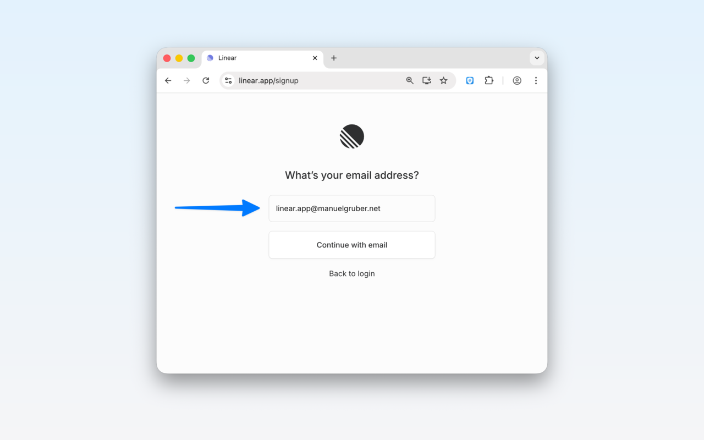
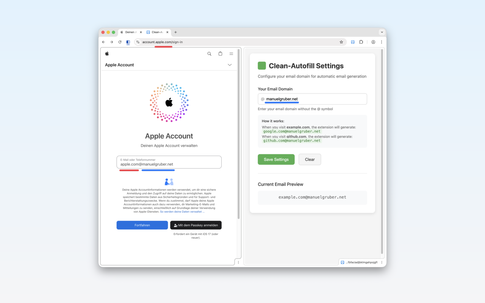

# Clean Autofill Chrome Extension

**Stop typing email addresses. One click, done.**

Clean Autofill is a Chrome extension for users with catch-all email domains who want unique, trackable email addresses for every website—without the hassle of typing them manually.

**[Install from Chrome Web Store](https://chromewebstore.google.com/detail/clean-autofill/klbbkndjohchnidkbnjijdbggfadpppf)**



## Why Clean Autofill?

If you use a catch-all email domain (like `@yourdomain.com`), you know the benefits:
- **Track who sells your data** — instantly know which company leaked your email
- **Easy filtering** — create rules based on the sender address
- **Spam control** — disable a single address without affecting others

But typing `sitename@yourdomain.com` on every signup form gets old fast. **Clean Autofill does it for you in one click.**

## Features

- **One-Click Fill** — Click the extension icon and your email is instantly filled
- **Automatic Domain Detection** — Generates emails like `linear.app@yourdomain.com` based on the current site
- **Smart Field Detection** — Finds email fields automatically, or fills your focused field
- **Privacy-First** — No data collection, no tracking, works entirely offline
- **Cross-Device Sync** — Your settings sync across Chrome browsers via your Google account



## How It Works

1. **Configure once** — Enter your catch-all email domain in settings (e.g., `manuelgruber.net`)
2. **Visit any website** — Navigate to a signup or login page
3. **Click the icon** — Clean Autofill generates and fills `sitedomain@yourdomain.com`

The extension extracts the main domain (removing subdomains like `www.` or `app.`) and combines it with your configured email domain:
- `linear.app/signup` → `linear.app@yourdomain.com`
- `account.apple.com` → `apple.com@yourdomain.com`
- `mail.google.com` → `google.com@yourdomain.com`

## Email Provider Compatibility

Clean Autofill supports two modes. Provider compatibility determines which mode you can use:

| Provider | Plus Addressing | Catch-All Prefix |
|----------|:-:|:-:|
| Gmail / Google Workspace | ✅ | — |
| Outlook / Hotmail / Live | ✅ | — |
| ProtonMail | ✅ | — |
| iCloud | ✅ | — |
| Fastmail | ✅ | — |
| Zoho Mail | ✅ | — |
| mailbox.org | ✅ | — |
| Hey | ✅ | — |
| Yahoo / Ymail | ❌ | — |
| GMX | ❌ | — |
| web.de | ❌ | — |
| T-Online | ❌ | — |
| Tuta (Tutanota) | ❌ | — |
| Custom domain | ✅* | ✅ |

\*If your email host supports plus addressing.

See [Email Provider Details](Email-Provider.md) for the full decision table and provider notes.

## Tech Stack

- **TypeScript** - Strict mode, compiles to `dist/`
- **Bun** - Test runner with happy-dom for DOM testing
- **Biome** - Linting and formatting (single tool, replaces ESLint + Prettier)
- **Husky** - Pre-commit hooks for automated checks
- **GitHub Actions** - CI/CD pipeline for automated testing
- **Chrome Extension Manifest V3**

## Build & Development Commands

```bash
# Build extension (compile TypeScript + copy assets to dist/)
bun run build

# Run tests (119 tests with DOM support)
bun test src/

# Run tests in watch mode
bun run test:watch

# Lint and format check
bun run check

# Lint and format fix
bun run check:fix

# TypeScript type check only
bun run typecheck

# Package extension for distribution
bun run pack

# Version bumping
bun run bump:patch    # 0.1.0 → 0.1.1
bun run bump:minor    # 0.1.0 → 0.2.0
bun run bump:major    # 0.1.0 → 1.0.0
```

## Architecture

The extension follows Chrome Extension Manifest V3 architecture with three main components:

### Service Worker (`src/background.ts`)
- Handles extension icon clicks via `chrome.action.onClicked`
- Generates email addresses using domain extraction logic
- Manages Chrome storage API for user settings
- Shows notifications for success/error states
- Opens options page on first install

### Content Script (`src/content.ts`)
- Injected into all web pages
- Receives messages from service worker to fill email fields
- Smart field detection with priority order:
  1. Currently focused input field
  2. Email-specific input fields (type="email", email-related names/ids)
  3. General text input fields
- Handles React/framework compatibility with native input events

### Options Page (`src/options.html` + `src/options.ts`)
- Settings interface for configuring user's email domain
- Uses Chrome sync storage for cross-device settings

### Shared Utilities (`src/utils.ts`)
- `extractMainDomain()` - Removes subdomains and handles special TLDs (.co.uk, .com.au, etc.)
- `isValidEmail()` - Basic email format validation
- `createTimeout()` - Promise-based timeout for async operations
- `debounce()` - Rate-limiting for input events

## Installation

### Chrome Web Store (Recommended)

Install directly from the [Chrome Web Store](https://chromewebstore.google.com/detail/clean-autofill/klbbkndjohchnidkbnjijdbggfadpppf).

### Developer Mode Installation (For Testing)

1. Open Chrome and navigate to `chrome://extensions/`
2. Enable "Developer mode" in the top right corner
3. Click "Load unpacked"
4. Select the Clean Autofill directory
5. The extension will appear in your extensions bar

### First-Time Setup

1. After installing, the extension will automatically open the settings page
2. Enter your email domain (e.g., `mg1.de`)
3. Click "Save Settings"
4. You can access settings later by right-clicking the extension icon and selecting "Options"

## Usage

1. **Navigate to any website**
2. **Click on a text field** where you want to enter an email (or let the extension find email fields automatically)
3. **Click the Clean Autofill icon** in your extensions bar - the email will be filled immediately!

The extension will:
- First try to fill the currently focused field
- If no field is focused, it will look for email input fields
- As a fallback, it will find any suitable text input field
- Show a notification with the filled email address
- Show error notifications if something goes wrong

## File Structure

```
Clean-Autofill/
├── manifest.json          # Extension configuration (MV3)
├── package.json           # NPM/Bun configuration
├── bunfig.toml            # Bun test configuration (DOM support)
├── .github/
│   └── workflows/
│       └── ci.yml         # GitHub Actions CI pipeline
├── src/                   # TypeScript source (edit these)
│   ├── background.ts      # Service worker
│   ├── background.test.ts # Service worker tests
│   ├── content.ts         # Content script for email filling
│   ├── content.test.ts    # Content script tests
│   ├── options.ts         # Options page logic
│   ├── options.test.ts    # Options page tests
│   ├── options.html       # Options page UI
│   ├── utils.ts           # Shared utilities
│   ├── utils.test.ts      # Utility tests
│   ├── test-setup.ts      # DOM test setup (happy-dom)
│   ├── types/
│   │   └── index.ts       # TypeScript type definitions
│   └── icons/             # Extension icons (16, 32, 48, 128px)
├── toolkit/
│   ├── biome/
│   │   └── biome.json     # Biome linter/formatter config
│   ├── typescript/
│   │   └── tsconfig.json  # TypeScript configuration
│   ├── husky/
│   │   └── pre-commit     # Pre-commit hook (typecheck, lint, test)
│   └── scripts/           # Build scripts
│       ├── build.js       # Compiles TS + copies assets to dist/
│       ├── pack.js        # Creates distribution zip
│       ├── validate.js    # Manifest validation
│       └── bump-version.js # Version management
├── docs/                  # Documentation
└── dist/                  # Build output (load this in Chrome)
    ├── *.js               # Compiled JavaScript
    ├── options.html       # Copied from src/
    ├── manifest.json      # Copied from root
    ├── icons/             # Copied from src/
    └── Clean-Autofill.zip # Distribution package
```

## Permissions

The extension requires minimal permissions:
- **activeTab**: To interact with the current tab
- **storage**: To save your email domain preference
- **notifications**: To show success/error messages

## Privacy

- No data is collected or transmitted
- Your email domain is stored locally in Chrome's sync storage
- The extension only runs when you click on it

## Troubleshooting

### Email not filling?
- Make sure you have set your email domain in settings
- Click on the text field first before using the extension
- Some websites may have special protections against automated filling

### Settings not saving?
- Check that you're entering a valid domain format (e.g., `example.com`)
- Don't include the @ symbol in your domain

## Development Workflow

1. Edit TypeScript files in `src/`
2. Run `bun run build` to compile to `dist/`
3. Load `dist/` folder in Chrome (chrome://extensions, Developer mode)
4. Run `bun test src/` to verify changes
5. Run `bun run check` before committing

Pre-commit hooks automatically run type checking, linting, and tests.

## Testing

Tests are colocated with source files (`*.test.ts`). DOM testing is supported via happy-dom.

```bash
bun test src/              # Run all 119 tests
bun run test:watch         # Watch mode
bun run test:coverage      # Coverage report (98%+ line coverage)
```

## Future Improvements

- Multiple email domain profiles
- Keyboard shortcuts
- Auto-fill on field focus
- Custom email formats
- Domain aliases

## License

MIT License
