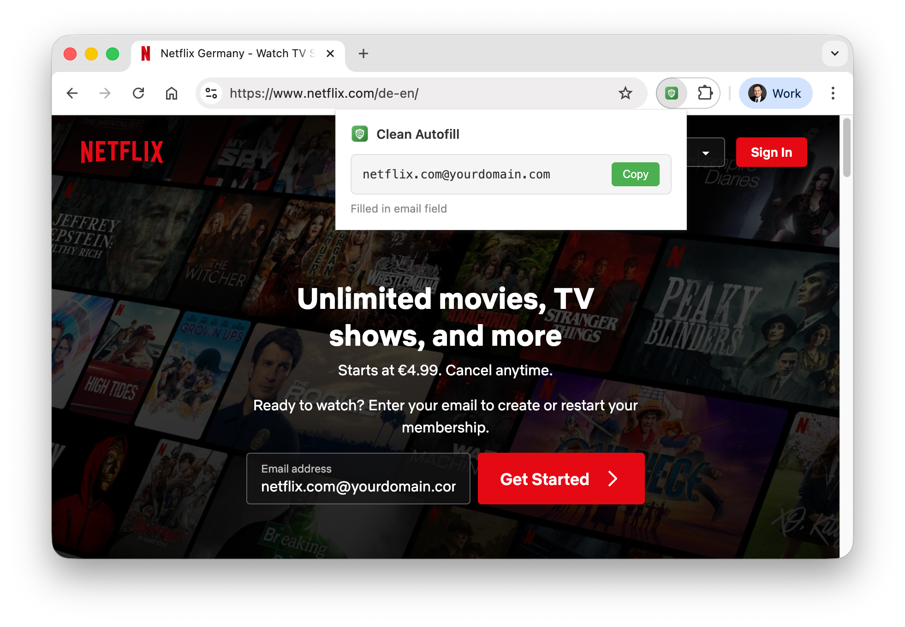
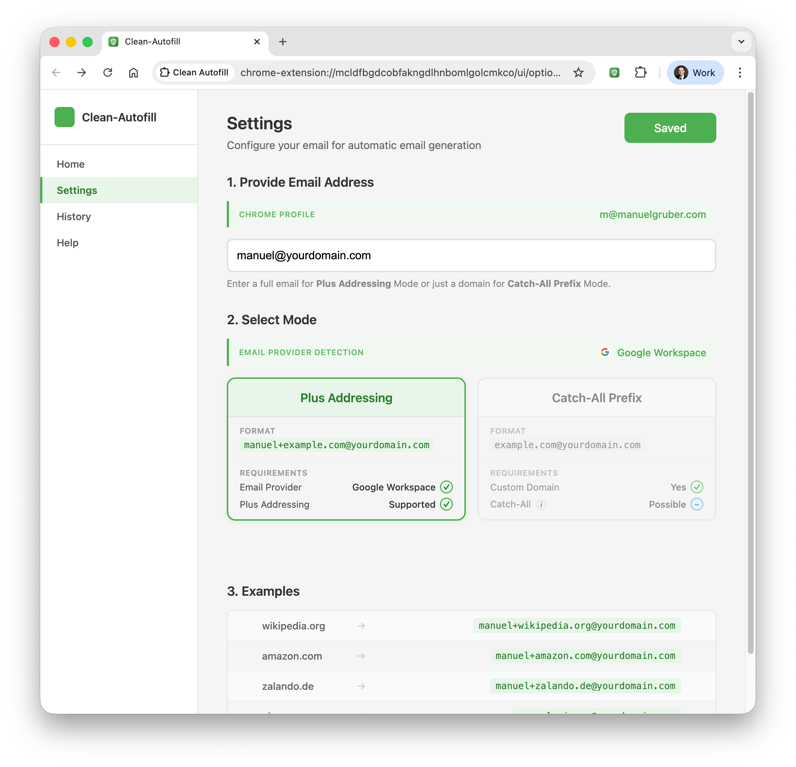

# Clean Autofill Chrome Extension

**Stop typing email addresses. One click, done.**

Clean Autofill is a Chrome extension that generates unique, trackable email addresses for every website — without the hassle of typing them manually. It supports both **Plus Addressing** (e.g., `you+site@gmail.com`) and **Catch-All Prefix** (e.g., `site@yourdomain.com`).

**[Learn more at zaai.com/clean-autofill](https://zaai.com/clean-autofill/)** | **[Install from Chrome Web Store](https://chromewebstore.google.com/detail/clean-autofill/klbbkndjohchnidkbnjijdbggfadpppf)**



## Why Clean Autofill?

If you want a unique email address per website, you know the benefits:
- **Track who sells your data** — instantly know which company leaked your email
- **Easy filtering** — create rules based on the sender address
- **Spam control** — disable a single address without affecting others

Whether you use plus addressing with Gmail or Outlook, or a catch-all domain like `@yourdomain.com`, typing a unique email on every signup form gets old fast. **Clean Autofill does it for you in one click.**

## Features

- **Two Email Modes** — Plus Addressing (`you+site@gmail.com`) or Catch-All Prefix (`site@yourdomain.com`)
- **One-Click Fill** — Click the extension icon and your email is instantly generated, filled, and ready to copy
- **Automatic Domain Detection** — Generates emails like `linear.app@yourdomain.com` based on the current site
- **Smart Field Detection** — Finds email fields automatically, or fills your focused field
- **Email Provider Detection** — Auto-detects your provider via MX record lookup and shows which modes are available
- **Email History** — Searchable log of every email generated, with copy and delete actions
- **Chrome Profile Import** — Auto-detects your Chrome profile email on first install
- **Provider Setup Guides** — Built-in catch-all configuration instructions for Google Workspace, Microsoft 365, Fastmail, and more
- **Privacy-First** — No analytics, no tracking. All data stays local (see [Privacy](#privacy) for one exception)
- **Cross-Device Sync** — Your settings sync across Chrome browsers via your Google account



## How It Works

1. **Configure once** — Enter your email address (for Plus Addressing) or custom domain (for Catch-All Prefix) in settings
2. **Visit any website** — Navigate to a signup or login page
3. **Click the icon** — A popup appears with the generated email, which is automatically filled into the page

The extension extracts the main domain (removing subdomains like `www.` or `app.`) and combines it with your configured email:

**Catch-All Prefix mode:**
- `linear.app/signup` → `linear.app@yourdomain.com`
- `account.apple.com` → `apple.com@yourdomain.com`
- `mail.google.com` → `google.com@yourdomain.com`

**Plus Addressing mode:**
- `linear.app/signup` → `you+linear.app@gmail.com`
- `account.apple.com` → `you+apple.com@gmail.com`
- `mail.google.com` → `you+google.com@gmail.com`

## Email Provider Compatibility

Clean Autofill supports two modes. Provider compatibility determines which mode you can use:

| Provider | Plus Addressing | Catch-All Prefix |
|----------|:-:|:-:|
| Custom domain | ✅* | ✅ |
| Google Workspace | ✅* | ✅ |
| Gmail | ✅ | — |
| Outlook / Hotmail / Live | ✅ | — |
| Apple iCloud | ❌ | — |
| Yahoo / Ymail | ❌ | — |
| ProtonMail | ✅ | — |
| GMX / web.de | ❌ | — |
| mail.com | ❌ | — |
| T-Online | ❌ | — |
| Fastmail | ✅ | — |
| mailbox.org | ✅ | — |

\*If your email host supports plus addressing. Outlook.com consumer accounts commonly work with `+tag` but Microsoft's official plus-addressing docs are for Exchange Online. Zoho Mail is unverified.

See [Email Provider Details](Email-Provider.md) for the full decision table and provider notes.

## Tech Stack

- **TypeScript** — Strict mode, compiles to `dist/`
- **Bun** — Test runner with happy-dom for DOM testing
- **Biome** — Linting and formatting (single tool, replaces ESLint + Prettier)
- **esbuild** — Bundling (ESM for service worker, IIFE for content scripts)
- **psl** — Public Suffix List library for accurate domain parsing
- **Husky** — Pre-commit hooks for automated checks
- **GitHub Actions** — CI/CD pipeline for automated testing and Chrome Web Store releases
- **Chrome Extension Manifest V3**

## Build & Development Commands

```bash
# Build extension (compile TypeScript + bundle + copy assets to dist/)
bun run build

# Run tests (with DOM support via happy-dom)
bun run test

# Run tests in watch mode
bun run test:watch

# Lint and format check
bun run check

# Lint and format fix
bun run check:fix

# TypeScript type check only
bun run typecheck

# Validate extension manifest and build output
bun run validate

# Package extension for distribution
bun run pack

# Package for release (pack + instructions)
bun run release

# Version bumping
bun run bump:patch    # 0.1.0 → 0.1.1
bun run bump:minor    # 0.1.0 → 0.2.0
bun run bump:major    # 0.1.0 → 1.0.0
```

## Architecture

The extension follows Chrome Extension Manifest V3 architecture:

### Service Worker (`src/extension/background.ts`)
- Handles messages from popup (`generateAndFill` action)
- Generates email addresses using domain extraction logic
- Supports two modes: Catch-All Prefix and Plus Addressing
- Saves generated emails to history via `src/ui/history.ts`
- Sends fill commands to the content script and returns results to popup
- Auto-detects Chrome profile email on first install
- Opens options page on first install

### Content Script (`src/extension/autofill.ts`)
- Injected into all web pages (including all frames)
- Receives messages from service worker to fill email fields
- Smart field detection with priority order:
  1. Currently focused input field
  2. Email-specific input fields (type="email", email-related names/ids)
  3. General text input fields
- Handles React/framework compatibility with native input events

### Popup (`src/ui/popup.html` + `src/ui/popup.ts`)
- Opens when the extension icon is clicked
- Triggers email generation and autofill via background script
- Displays the generated email address
- Copy button for clipboard access
- Shows configuration prompt if email is not yet set up

### Options Page (`src/ui/options.html` + `src/ui/options.ts`)
- Sidebar navigation with four pages:
  1. **Home** — Extension explanation, how-it-works steps, live examples based on current settings
  2. **Settings** — Email input, mode selection (Plus Addressing / Catch-All Prefix), Chrome profile import, email provider detection with MX lookup
  3. **History** — Searchable table of all generated emails, copy/delete per entry, clear all
  4. **Help** — Provider-specific catch-all setup instructions

### Email Utilities (`src/email/utils.ts`)
- `extractMainDomain()` — Uses PSL (Public Suffix List) for accurate domain extraction; handles special TLDs, IPv4/IPv6, localhost
- `isValidEmail()` — Basic email format validation
- `createTimeout()` — Promise-based timeout for async operations
- `debounce()` — Rate-limiting for input events

### History Module (`src/ui/history.ts`)
- CRUD operations: `addEntry()`, `getHistory()`, `deleteEntry()`, `clearHistory()`
- Stored in `chrome.storage.local` with a 10,000 entry limit
- Supports search filtering and pagination

### Provider Detection (`src/email/providers.ts` + `src/email/provider-domains.ts`)
- `getProviderStatus()` — Synchronous lookup against 300+ known provider domains
- `getProviderStatusWithMx()` — Falls back to MX record lookup for unknown/custom domains
- Categorizes providers as: plus-supported, plus-unsupported, or custom

### MX Lookup (`src/email/mx-lookup.ts`)
- DNS MX record lookup via Google DNS-over-HTTPS API (`https://dns.google/resolve`)
- Two-tier caching: in-memory (session) + `chrome.storage.local` (persistent)
- Detects providers from MX exchange patterns (Google Workspace, Microsoft 365, Fastmail, Proton Mail, Zoho, iCloud, Mimecast, Barracuda)

### Catch-All Instructions (`src/email/catch-all-instructions.ts`)
- Step-by-step setup guides per provider (Google Workspace, Microsoft 365, Fastmail, Proton Mail, Zoho, iCloud)
- Includes admin console URLs
- Generic fallback for unrecognized providers

### Options Preview (`src/ui/options-preview.ts`)
- Live email preview on the options page based on current settings

## Installation

### Chrome Web Store (Recommended)

Install directly from the [Chrome Web Store](https://chromewebstore.google.com/detail/clean-autofill/klbbkndjohchnidkbnjijdbggfadpppf).

### Developer Mode Installation (For Testing)

1. Open Chrome and navigate to `chrome://extensions/`
2. Enable "Developer mode" in the top right corner
3. Click "Load unpacked"
4. Select the `dist/` directory after building
5. The extension will appear in your extensions bar

### First-Time Setup

1. After installing, the extension will automatically open the settings page
2. Enter your email address (for Plus Addressing) or custom domain (for Catch-All Prefix)
3. The extension auto-detects your email provider and shows which modes are available
4. You can access settings later by right-clicking the extension icon and selecting "Options"

## Usage

1. **Navigate to any website**
2. **Click the Clean Autofill icon** in your extensions bar — a popup appears with the generated email
3. The email is **automatically filled** into detected email fields on the page
4. Use the **Copy button** in the popup if you need to paste it elsewhere

The extension will:
- First try to fill the currently focused field
- If no field is focused, it will look for email input fields
- As a fallback, it will find any suitable text input field
- Show the fill status in the popup

## File Structure

```
Clean-Autofill/
├── manifest.json               # Extension configuration (MV3)
├── package.json                # NPM/Bun configuration
├── .github/
│   └── workflows/
│       ├── W1-Test.yml         # CI: typecheck, lint, test, build, validate
│       ├── W2-Build.yml        # Build + package + upload artifact
│       └── W3-Release-Chrome-Web-Store.yml  # Full pipeline + CWS publish
├── src/
│   ├── email/                  # Email generation & provider logic
│   │   ├── utils.ts            # Domain extraction, validation, shared helpers
│   │   ├── utils.test.ts
│   │   ├── providers.ts        # Provider status detection
│   │   ├── providers.test.ts
│   │   ├── provider-domains.ts # 300+ known provider domains
│   │   ├── provider-domains.test.ts
│   │   ├── mx-lookup.ts        # DNS MX record lookup via Google DNS API
│   │   ├── mx-lookup.test.ts
│   │   ├── catch-all-instructions.ts  # Provider-specific setup guides
│   │   └── catch-all-instructions.test.ts
│   ├── extension/              # Chrome extension core
│   │   ├── background.ts       # Service worker
│   │   ├── background.test.ts
│   │   ├── autofill.ts         # Content script for email filling
│   │   └── autofill.test.ts
│   ├── ui/                     # User-facing pages
│   │   ├── popup.html          # Popup UI
│   │   ├── popup.ts            # Popup logic
│   │   ├── popup.test.ts
│   │   ├── options.html        # Options page (4-tab sidebar)
│   │   ├── options.ts          # Options page logic
│   │   ├── options.test.ts
│   │   ├── options.css         # Options page styles
│   │   ├── options-preview.ts  # Live email preview
│   │   ├── options-preview.test.ts
│   │   ├── history.ts          # Email history CRUD
│   │   ├── history.test.ts
│   │   └── message-tokens.css  # Shared CSS tokens
│   ├── types/
│   │   ├── index.ts            # TypeScript type definitions
│   │   └── psl.d.ts            # PSL library type declarations
│   └── icons/                  # Extension icons (16, 32, 48, 128px)
│       └── providers/          # Provider logos (22 providers)
├── toolkit/
│   ├── biome/
│   │   └── biome.json          # Biome linter/formatter config
│   ├── bun/
│   │   └── bunfig.toml         # Bun test runner config
│   ├── typescript/
│   │   └── tsconfig.json       # TypeScript configuration
│   ├── husky/
│   │   └── pre-commit          # Pre-commit hook (typecheck, lint, test)
│   ├── scripts/                # Build scripts
│   │   ├── build.js            # Compile TS + bundle + copy assets
│   │   ├── pack.js             # Create distribution zip
│   │   ├── validate.js         # Manifest validation
│   │   └── bump-version.js     # Version management
│   └── test/
│       └── test-setup.ts       # DOM test setup (happy-dom)
├── docs/                       # Documentation
│   ├── README.md               # This file
│   ├── PRIVACY.md              # Privacy policy
│   ├── Email-Provider.md       # Provider compatibility details
│   ├── Screenshots/            # Extension screenshots
│   └── store-listing/          # Chrome Web Store listing assets
└── dist/                       # Build output (load this in Chrome)
    ├── extension/              # Compiled extension scripts
    ├── email/                  # Compiled email modules
    ├── ui/                     # Compiled UI pages
    ├── icons/                  # Copied from src/
    ├── manifest.json           # Copied from root
    └── Clean-Autofill.zip      # Distribution package
```

## Permissions

The extension requires the following permissions:

- **activeTab** — To interact with the current tab and read its URL
- **storage** — To save settings (sync) and email history (local)
- **notifications** — To show install and error notifications
- **identity** — To detect the Chrome profile email for auto-configuration
- **identity.email** — To read the Chrome profile email address

**Host permissions:**
- **`https://dns.google/*`** — For MX record lookups to detect email providers on custom domains

## Privacy

- Settings sync across Chrome browsers via Chrome's sync storage
- Email history is stored locally in `chrome.storage.local` and never transmitted
- When you enter a custom domain email, the extension performs a one-time MX record lookup via Google's public DNS API (`dns.google`) to detect your email provider. Only the domain is sent (not your email address). Results are cached locally.
- No analytics, tracking, or data collection

See [Privacy Policy](PRIVACY.md) for full details.

## Troubleshooting

### Email not filling?
- Make sure you have set your email in settings
- Click on the text field first before using the extension
- Some websites may have special protections against automated filling

### Settings not saving?
- Check that you're entering a valid email or domain format (e.g., `you@gmail.com` or `example.com`)
- Don't include the @ symbol when entering a domain only

### Email mode not available?
- Your email provider may not support plus addressing. Check the Settings page for provider detection results
- See the [Email Provider Compatibility](Email-Provider.md) page for details

### MX lookup not working?
- The extension needs network access to `dns.google` for provider detection on custom domains
- Check that the host permission is granted in your extension settings

## Development Workflow

1. Edit TypeScript files in `src/` (organized into `email/`, `extension/`, `ui/`, `types/`)
2. Run `bun run build` to compile to `dist/`
3. Load `dist/` folder in Chrome (chrome://extensions, Developer mode)
4. Run `bun run test` to verify changes
5. Run `bun run check` before committing
6. Run `bun run validate` to verify manifest and build output

Pre-commit hooks automatically run type checking, linting, and tests.

## Testing

Tests are colocated with source files (`*.test.ts` next to each module). DOM testing is supported via happy-dom.

```bash
bun run test               # Run all tests
bun run test:watch         # Watch mode
bun run test:coverage      # Coverage report
```

Test suites cover: email utilities, provider detection, provider domains, MX lookup, catch-all instructions, autofill content script, background service worker, popup, options page, options preview, and email history.

## Future Improvements

- Multiple email domain profiles
- Keyboard shortcuts
- Auto-fill on field focus
- Custom email format templates
- Domain aliases

## License

MIT License
